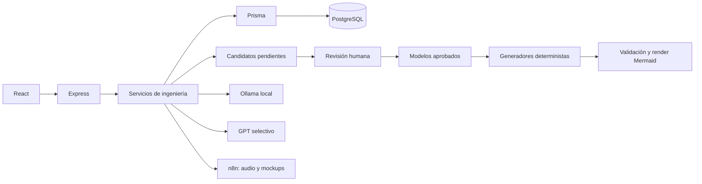

# ICASE — ingeniería de software trazable

ICASE transforma fuentes PDF, audio, texto manual y propuestas de chat en requisitos y modelos revisados por personas. PostgreSQL/Prisma conserva los datos estructurados; Ollama y GPT proponen candidatos; Mermaid representa modelos aprobados; n8n orquesta transcripción y mockups.

## Inicio con Docker

1. Copiar `.env.example` a `.env` y completar los proveedores que se usarán.
2. Ejecutar `docker compose up --build -d`.
3. Abrir http://localhost:3001. Salud de API: http://localhost:8080/api/health.

PostgreSQL se publica en `localhost:5433`; entre contenedores se usa `postgres:5432`. El arranque mantiene la estrategia existente `prisma db push --skip-generate`: no ejecuta resets ni acepta pérdida de datos automáticamente. `prisma generate` se ejecuta durante el build. Para desarrollo local, definir `DATABASE_URL` y ejecutar `npm ci`, `npm run prisma:generate` y `npm start` en `backend`; `npm ci` y `npm run dev` en `frontend`.

## Arquitectura de ICASE



Este diagrama describe ICASE. No se asigna esa arquitectura a los proyectos analizados.

## Flujo de trabajo

- **PDF:** Fuentes → subir uno o varios PDF → texto extraído y SourceVersion → analizar → Revisión Candidatos. La misma evidencia conserva fuente, versión y calidad. Un nuevo PDF con el mismo nombre crea otra versión; el mismo hash se reconoce como duplicado.
- **Audio:** Fuentes → entrevista → webhook n8n → transcript y AudioSegment con timestamps → analizar → aprobar requisitos. Los requisitos y sus modelos derivados conservan relaciones de evidencia con esos segmentos.
- **Manual y chat:** Chat → guardar fuente manual, o marcar «Proponer cambio para revisión». Los mensajes de cambio crean NeedCandidate y RequirementCandidate, sin alterar requisitos oficiales.
- **Requisitos:** editar candidatos, consultar «Evaluación basada en criterios de ISO/IEC/IEEE 29148:2018» y aprobar/rechazar. Es una evaluación heurística, no una certificación. El qualityReport se copia al requisito y se reevalúa cuando cambia.
- **Modelado:** generar desde requisitos APPROVED. Revisar actores, casos de uso, entidades, atributos, relaciones, reglas, navegación y tecnologías. Crear candidatos manuales para información confirmada. Los selectores permiten enlazar requisitos y modelos. La edición estructurada avanzada permite relaciones UML con evidencia.
- **Arquitecturas:** en Modelado → Arquitectura → crear candidato. Elegir software o sistema; indicar componentes y conexiones confirmados. No se inventan cloud, IP, puertos, versiones, infraestructura ni cardinalidades.
- **Diagramas:** elegir E/R, casos de uso, navegación, arquitectura software o arquitectura sistema. Abrir la versión, validar/renderizar y aprobar. Una versión ERROR no desplaza la aprobada. Los casos de uso se representan mediante flowchart/subgraph.
- **Mockups:** aprobar navegación y plataforma, configurar n8n, generar y revisar versiones. Se envía contexto estructurado aprobado, sin enviar el PDF ni la descripción completa. La respuesta debe corresponder a las pantallas solicitadas. No hay fallback silencioso a datos ficticios cuando falla n8n.
- **Cambios:** editar/desactivar un requisito aprobado propone un ChangeRequest. El modal muestra dependencias directas e indirectas antes de continuar. La transacción aplica el cambio, guarda historial y marca dependientes OUTDATED. Los conflictos detectados entre nuevas fuentes y requisitos se pueden convertir en solicitudes desde Cambios.
- **Regeneración:** revisar modelos afectados y regenerar únicamente el artefacto elegido. Para modelos manuales desactualizados, «Revisar este modelo» permite actualizarlo conservando su identidad. No se borran versiones anteriores.
- **Versiones:** consultar historial de requisitos y artefactos, comparar estructuras, crear baselines y exportar JSON/Markdown. Restaurar agrega una nueva versión basada en la anterior, sin borrar las posteriores. Las restauraciones de requisitos requieren confirmar impacto; las de artefactos crean candidatos.

La navegación usa WEB, MOBILE, BOTH o UNKNOWN. Confirmar plataforma antes de generar mockups cuando no consta en los nodos. Los modelos de proyectos preexistentes quedan pendientes de revisión: no se consideran aprobados por el mero hecho de migrarlos.

## Persistencia y concurrencia

Se amplían `Actor`, `Entity` (entidades del sistema analizado), `EntityAttribute`, `EntityRelationship`, `NavigationNode`, `Architecture`, `Screen` y `Requirement`. Se agregan `ModelCandidate`, `UseCase`, `BusinessRule`, `Technology`, `Artifact`, `ArtifactVersion`, `ArtifactRelation`, `RequirementVersion`, `ChangeRequest` y `ProjectBaseline`.

`ModelCandidate.kind` comparte el sobre de revisión de actores, entidades y otros modelos; no existe una segunda tabla oficial para cada candidato. `Entity` sigue siendo el modelo de dominio ya existente. No se crean tablas reales para el sistema analizado.

Las relaciones tienen dirección evidencia/dependencia → elemento derivado. Los snapshots y enlaces históricos se conservan. La evaluación de impacto recorre el grafo con detección de ciclos. Las operaciones críticas usan transacciones Serializable, revisión optimista y restricciones únicas para versiones. Un conflicto devuelve VERSION_CONFLICT y exige refrescar, sin sobrescribir cambios concurrentes. Archivar proyectos y desactivar requisitos conserva historial.

Los diagramas se generan en `services/diagrams/DiagramRegistry.js` y los generadores existentes; incorporar un tipo nuevo requiere registrar su estrategia y definir su snapshot. Mermaid no se guarda como fuente de verdad. El frontend ejecuta `mermaid.parse` y `mermaid.render` con seguridad estricta; la API exige el reconocimiento de renderizado en la aprobación.

## API

Los endpoints anteriores se mantienen. Los recursos nuevos se agrupan bajo `/api/projects/:projectId/engineering`:

| Recurso | Operaciones |
| --- | --- |
| `/` y `/export` | GET estado estructurado y trazabilidad |
| `/models/generate` | POST candidatos desde requisitos aprobados, `requirementIds` opcional |
| `/models` | POST candidato manual, `targetId` opcional para revisar un modelo pendiente/desactualizado |
| `/models/:id` | PATCH editar/aprobar/rechazar candidato |
| `/diagrams` | POST generar versión por `type`, `artifactId` opcional |
| `/versions/:id` | PATCH aprobar/rechazar/reportar ERROR |
| `/versions/:id/restore` | POST crear versión basada en la seleccionada |
| `/impact/:type/:id` | GET dependencias e impacto |
| `/changes` y `/changes/:id` | POST proponer; PATCH aprobar con `confirmImpact: true` o rechazar |
| `/baselines` y `/baselines/:id` | POST crear; GET consultar snapshot |
| `/compare` | POST `before`, `after`, `type` Requirement/Artifact/Baseline |
| `/sources/text` | POST texto MANUAL/CHAT versionado |
| `/chat` | POST consulta local, Ollama o GPT; `proposeChange` opcional |
| `/platform` | PATCH confirmar plataforma |

`POST /api/projects/:projectId/mockup` conserva la integración n8n; `artifactId` permite regenerar una pantalla concreta. Los errores de dominio no incluyen stack traces en respuestas.

## Variables e integraciones

- `DATABASE_URL`, `POSTGRES_USER`, `POSTGRES_PASSWORD`, `POSTGRES_DB`: PostgreSQL.
- `PORT`, `FRONTEND_URL`, `VITE_API_URL`: API y frontend.
- `AI_PROVIDER`: proveedor del análisis antiguo compatible; `mock` es demostración explícita. El análisis antiguo y la importación solo crean candidatos de requisitos.
- `AI_ANALYSIS_STRATEGY`: `deterministic-only`, `ollama-only`, `gpt-only`, `ollama-first`.
- `OLLAMA_BASE_URL`, `OLLAMA_MODEL`, `OLLAMA_TIMEOUT`: analizador local. Con Docker, URL `http://ollama:11434`; instalar el modelo seleccionado con `docker compose exec ollama ollama pull <modelo>`.
- `OPENAI_API_KEY`, `OPENAI_MODEL`: interpretación selectiva. El proveedor existente admite prompts específicos para fragmentos y chat. No se llama a GPT para generar Mermaid.
- `AI_MAX_CHUNKS`, `AI_CHUNK_MAX_LENGTH`, `AI_FALLBACK_CONFIDENCE_THRESHOLD`: límites del análisis semántico. Los proveedores no disponibles dejan evidencia para revisión, sin fabricar necesidades.
- `N8N_TRANSCRIBE_WEBHOOK` o alias `N8N_TRANSCRIPTION_WEBHOOK`: recibe multipart `audio`, `file`, `projectId`; retorna texto y segmentos `{start, end, text, speaker}`.
- `N8N_MOCKUP_WEBHOOK`: recibe `screens`, requisitos/actores/casos de uso aprobados y plataforma; retorna `{screens: [{name, route, html, components}]}`. Mantener nombres/rutas de entrada. HTML se muestra en iframe sandbox sin scripts.
- `N8N_TIMEOUT`, `MOCKUP_MAX_REQUIREMENTS`, `MAX_PDF_SIZE_MB`, `MAX_AUDIO_SIZE_MB`: límites de integración.

Los workflows n8n viven fuera de este repositorio; las URLs de ejemplo están vacías deliberadamente. Las credenciales reales no se incluyen en el código.

## Pruebas

```sh
# Suites sin proveedores externos
cd backend
npm test

# HTTP, PostgreSQL y PDF real; webhook n8n local de prueba
npm run test:integration

# Regresión del proveedor mock explícito, requiere PostgreSQL
node tests/ai.test.js

# Navegador real: cinco tipos Mermaid y aprobación/impacto en UI
cd ../frontend
npm run test:e2e
npm run build
```

En Docker: `docker compose exec backend npm test` y `docker compose exec backend npm run test:integration`. La integración usa la base configurada, crea proyectos identificados como E2E y los archiva al terminar; no borra datos existentes. El test de navegador necesita API en 8080 e inicia Vite en 4175. Usa Edge instalado; puede elegirse Chrome con `PLAYWRIGHT_CHANNEL=chrome` o instalar/configurar Chromium en otros sistemas.

La prueba histórica `backend/tests/document.test.js` necesita `AUTRON_Propuesta_Overleaf.pdf`, no incluido. La nueva integración extrae un PDF de fixture autocontenido y prueba el flujo sin ese archivo.

## Alcance pendiente

Ver [docs/PENDING.md](docs/PENDING.md) para limitaciones precisas, integraciones no verificadas y mejoras técnicas pendientes. No se declara validada una conexión real a n8n, GPT u Ollama por el resultado de pruebas con fixtures.
